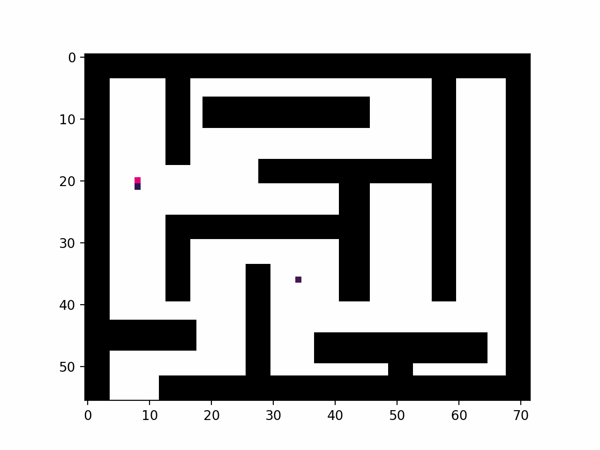

# A* Algorithm in Python 🕸
> Using the A* algorithm to traverse an occupancy grid. By executing the algorithm, the user is prompted to set the start and end points inside the grid. Then, the robot will find the shortest path to the goal, displaying the path on the map and saving it to a file afterwards

 

## Group 🎢
- [Lucas Moreira](https://github.com/lucasmsa)
- [Matheus Arnaud](https://github.com/arnaudmatheus)
- [Renan Goes](https://github.com/Renan-Goes)

## Installating dependencies 🔧
- Inside the root directory of the project, run the following command: `pip install -r requirements.txt`

## Running the program 🚀
- On the root directory, execute: `python src/a_star.py`

## Result 🧩

