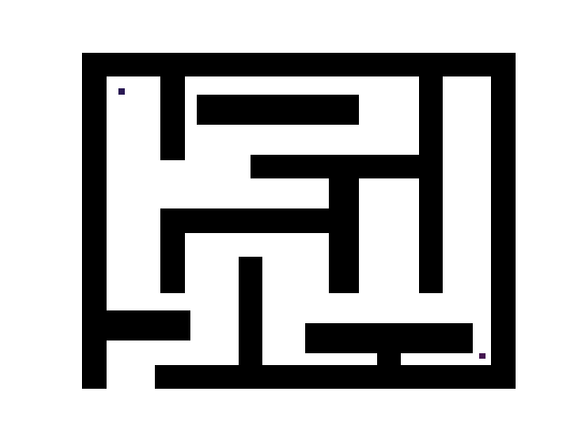

# A* Algorithm in Python 🕸
> A* over an occupancy grid built from a floor plan. Walls are inflated by the robot radius, the plan is downsampled to a 72x56 grid, and the robot finds the cheapest path from start to goal. The search frontier and the final path are saved as a GIF.

This repo is the reference implementation. The web version, with a scrubber, more algorithms and image import, lives at [pixel-algorithms](https://github.com/lucasmsa/pixel-algorithms) and is tested against the golden fixtures in [`fixtures/`](./fixtures).

 

## Group 🎢
- [Lucas Moreira](https://github.com/lucasmsa)
- [Matheus Arnaud](https://github.com/arnaudmatheus)
- [Renan Goes](https://github.com/Renan-Goes)

## Installing dependencies 🔧
- Inside the root directory of the project, run: `pip install -r requirements.txt`

## Running the program 🚀
- Headless, start and goal as grid cells: `python src/a_star.py --start 6 6 --goal 66 50`
- Interactive, click start then goal on the grid: `python src/a_star.py`
- Options: `--map` (any image, dark pixels are walls), `--robot-radius` (wall inflation in pixels, default 7), `--connectivity 4|8`, `--heuristic manhattan|euclidean|chebyshev|octile`, `--out`, `--show`
- Outputs go to `output/`: the grid PNG, the grid with start and goal, and `a_star_animation.gif`

## How the search works 🧭
- Step cost is 1 for orthogonal moves and √2 for diagonals; the heuristic defaults to octile, so it is admissible
- Diagonal moves cannot cut corners: both orthogonal neighbours must be free
- The open list is a binary heap; ties on f break on lower h, then insertion order, so the expansion order is deterministic
- Neighbours are visited in the order up, down, left, right, then the four diagonals

## Tests and fixtures 🧪
- `python -m pytest`: 39 tests, including optimality checks against an independent Dijkstra on random grids
- `python scripts/make_fixtures.py` regenerates three golden fixtures: `open_room` (10x8), `corridors` (20x15, 4-connected, manhattan) and `mapa_robotica` (72x56, from `data/mapa_robotica.bmp`). Each one records grid, start, goal, path, expansion order and cost

## Result 🧩

Magenta is the explored frontier, green is the path. Start (6, 6) to goal (66, 50): 94 cells, cost 103.36, 1284 cells expanded.
